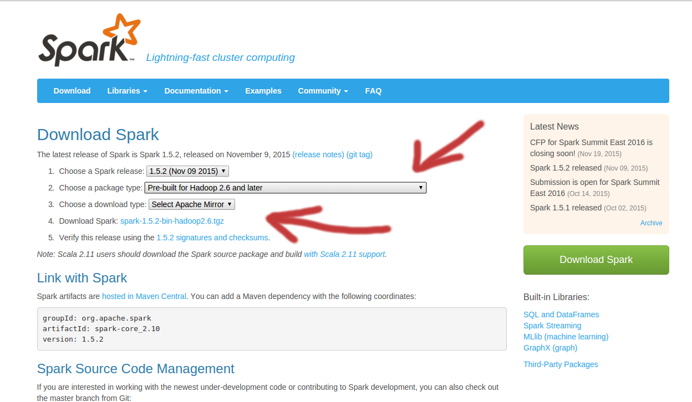

## Requirements

First, you must have R and java installed. This is a bit 
out the scope of this note, but Let me cover few things.

On Ubuntu:
```
sudo add-apt-repository ppa:webupd8team/jav
sudo apt update
sudo apt install oracle-java8-installer
```

You can manage java version by calling
```
sudo update-alternatives --config java
```
and editing:
```
sudo nano /etc/environment
```
by adding line
```
JAVA_HOME="/usr/lib/jvm/java-8-oracle"
```
Then test it by calling
```
source /etc/environment
echo $JAVA_HOME
java -version
```

### R

https://launchpad.net/~marutter/+archive/ubuntu/c2d4u

```
sudo add-apt-repository ppa:marutter/c2d4u
sudo apt update
sudo apt install r-base r-base-dev
```

### Rstudio

```
sudo apt-get install gdebi-core

wget https://download1.rstudio.org/rstudio-xenial-1.1.453-amd64.deb
sudo gdebi rstudio-xenial-1.1.453-amd64.deb
rm rstudio-xenial-1.1.453-amd64.deb
```

### rJava

Next, you have to see if you can install R interface to java. This can
be done by calling
```
sudo R CMD javareconf
```

Now you can install in R it:
```
install.packages("rJava")
```

Depending or your Operating System this can produce an error, and some
extra action would be required. Please google something like `rJava
install error ubuntu` etc. 

Test it in R by calling, for example:
```{r}
library(rJava)
.jinit()
Double <- J("java.lang.Double")
d <- new(Double, "10.2")
d
```

### R and rJava on Mac

https://github.com/snowflakedb/dplyr-snowflakedb/wiki/Configuring-R-rJava-RJDBC-on-Mac-OS-X

### Other packages

You can also install few packages we may use in presentation. Simply call:

```
install.packages(c("rmarkdown", "ggplot2", "magrittr", "whisker", "data.table"))
```

* `rmarkdown`: package that makes possible to create this document
* `ggplot2`: popular graphing package,
* `magrittr`: nicer functions chaining
* `whisker`: it's Movember
* `data.table`, `reshape2`: an alternative for "data.frame"

## Downloading Spark

The easiest way to downloading spark is getting pre-bulid version from
[http://spark.apache.org/downloads.html]. 

<center>

 

</center>

### Mac
https://www.r-bloggers.com/six-lines-to-install-and-start-sparkr-on-mac-os-x-yosemite/

## SparkR test drive

The way we use SparkR here is far from being en example of _best
practice_. Not only because it does not run on more than one computer,
but also because we isolate the SparkR package from other packages by
hardcoding library path. This should help you set up you Spark(R) fast
for test drive.

Lets say you have downloaded and uncompress it to the folder

`/home/bartek/programs/spark-2.3.0-bin-hadoop2.7`

So every time you see this path please change it to the one you have
(windows users have to probably change also slashes `/` to backslashes `\` and add something like `/C/`)


Then try to run the following code in R:
```{r}
spark_path <- '/Users/bartek/programs/spark-2.3.0-bin-hadoop2.7'
if (nchar(Sys.getenv("SPARK_HOME")) < 1) {
  Sys.setenv(SPARK_HOME = spark_path)
}
library(SparkR, lib.loc = c(file.path(Sys.getenv("SPARK_HOME"), "R", "lib")))
sparkR.session(master = "local[*]", sparkConfig = list(spark.driver.memory = "2g"))
```


```{r}
library('magrittr')
library('ggplot2')

df <- as.DataFrame(mtcars)
model <- glm(mpg ~ wt, data = df, family = "gaussian")
summary(model)
predictions <- predict(model, newData = df)
class(predictions)
```

```{r}
predictions %>%
  select("wt", "mpg", "prediction") %>%
  collect %>%
  ggplot() + geom_point(aes(wt, prediction - mpg))  +
  geom_hline(yintercept=0) + theme_bw()
```

## Sparklyr

One can also install sparklyr. First we install devtools.

```
install.packages("devtools")
devtools::install_github("hadley/devtools") ## for latest version
devtools::install_github("rstudio/sparklyr")
devtools::install_github("tidyverse/dplyr")
```

Check available versions:
```{r}
library(sparklyr)
spark_available_versions()
```

```{r}
spark_install(version = "2.3.0")
```

### sparkR in sparklyr

```{r}
library(sparklyr)
sc <- spark_connect(master = "local")
spark_path = sc$spark_home
spark_disconnect(sc)

Sys.setenv(
  SPARK_HOME=spark_path
)
library(SparkR, lib.loc = c(file.path(Sys.getenv("SPARK_HOME"), "R", "lib")))
sparkR.session(master = "local[*]", sparkConfig = list(spark.driver.memory = "2g"))
```

## Contact

bartekskorulski@gmail.com
